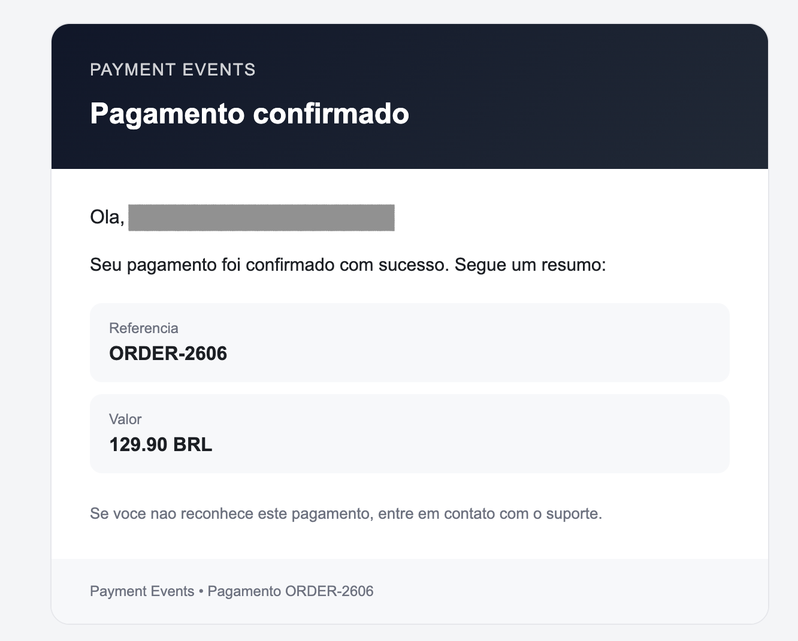
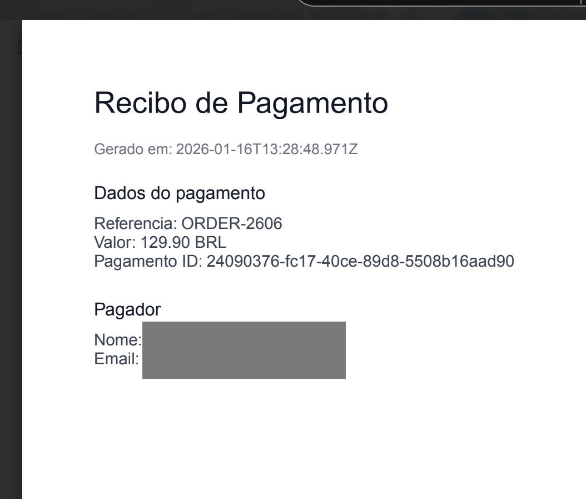

# Payment Events MVP

API de pagamentos fake usando NestJS + MySQL com arquitetura event-driven. Ao confirmar um pagamento, o registro e um evento `payment.confirmed` sao disparados para multiplos listeners.

## Stack

- Node.js 20
- NestJS
- TypeScript
- MySQL + TypeORM
- @nestjs/event-emitter
- Docker / Docker Compose

## Como rodar com Docker

```bash
cp .env.example .env

docker-compose up --build
```

A API fica disponivel em `http://localhost:3000`.

## Rotas

- `POST /payments/confirm`

Payload de exemplo:

```json
{
  "amount": 125.5,
  "currency": "BRL",
  "reference": "ORDER-123",
  "personId": "uuid-da-pessoa"
}
```

- `GET /payments`

Lista pagamentos confirmados.

- `POST /persons`

Payload de exemplo:

```json
{
  "name": "Ana Souza",
  "email": "ana.souza@example.com",
  "document": "111.111.111-11"
}
```

- `GET /persons`

## Estrutura

Veja a pasta `src/` para modulos, entidades e listeners de eventos.

## Demonstração

Email de confirmação:



Recibo em anexo:


